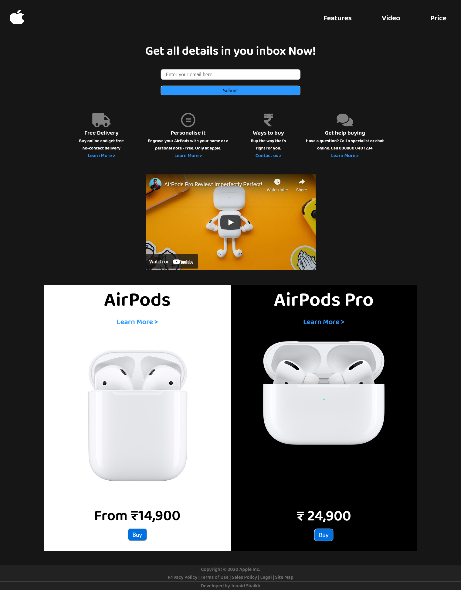

# FreeCodeCamp - Product Landing Page Solution

This is a solution to the [Build a Product Landing Page](https://www.freecodecamp.org/learn/responsive-web-design/responsive-web-design-projects/build-a-product-landing-page).  

## Table of contents

- [Overview](#overview)
  - [The challenge](#the-challenge)
  - [Screenshot](#screenshot)
  - [Links](#links)
- [My process](#my-process)
  - [Built with](#built-with)
  - [What I learned](#what-i-learned)
- [Author](#author)

## Overview

### The challenge

The challenge is to fulfill the user-stories given in the challenge and build a product landing page, applying desing as per your choice. 

### Screenshot

### Links

- Solution URL: [Solution](https://github.com/junaidshaikh-js/product-landing-page)
- Live Site URL: [Live Site](https://junaidshaikh-js.github.io/product-landing-page/)

## My process

### Built with

- Semantic HTML5 markup
- CSS custom properties
- CSS Flexbox
- Media queries used to make responsive webpage

### What I learned

This challenge provided me opportunities to learn many new things. The most amazing thing I learned in this challenge is to use the vectors icons and social logos taken from site [fontawesome](https://fontawesome.com/)  The `iframe` HTML element is great way to embed other pages into your website. I used this tag to embed a Youtube video, also you can embed google maps and other websites into your webpage. The desing is taken from the original Apple Airpods webpage.

## Author

- Linkedin Profile - [Junaid Shaikh](https://www.linkedin.com/in/junaidshaikhjs/)
